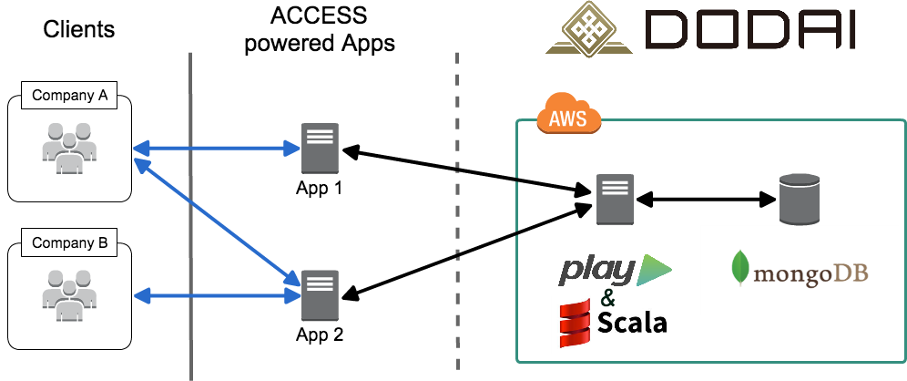
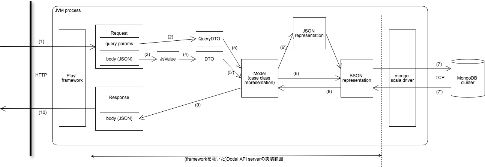
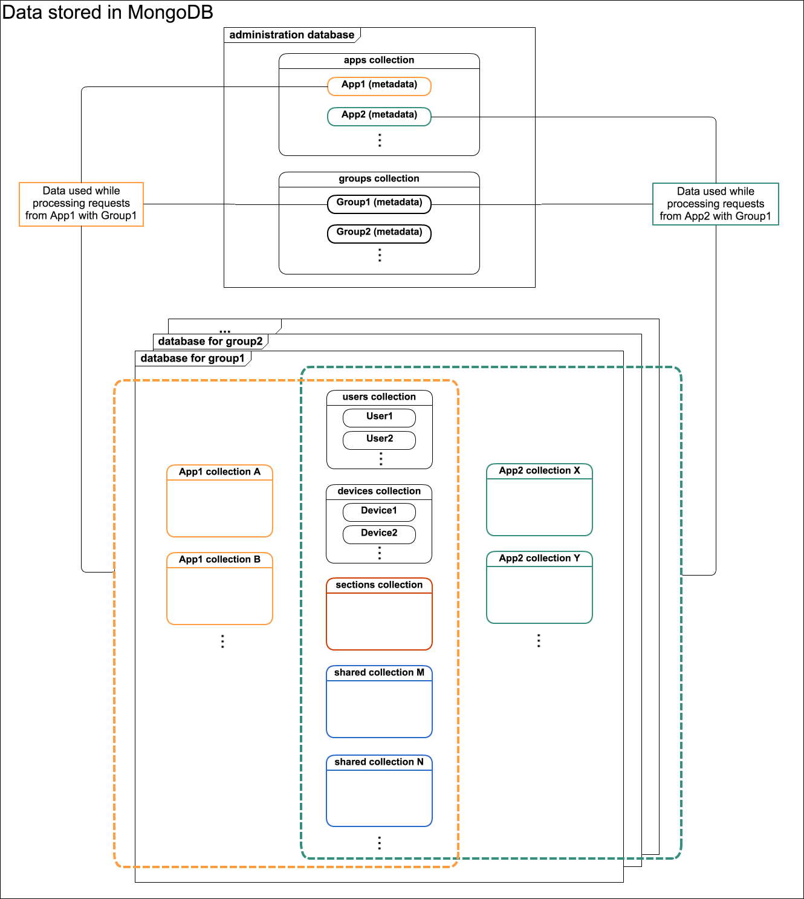

footer: Mickey Chen @ Access Taiwan
slidenumbers: true
build-lists: true

# Diving in to 土台 (Dodai)
From a rookie's POV

---

# Disclaimer!
> I am new!

^ haven't worked with Dodai

---

## Dodai == 土台 == 地基

---

## What we are going to talk about

- Philosophy
- Running Dodai
- Development

---

# Philosophy
My Hypothosis 🤞

---

##[fit] Multi-Tenent Data Layer

---

### Includes...
- Design
- Access Control
- APIs & Client Library

---

## Design

---

### 2 Ways of Accessing Data

1. Through a Server (ie. Antikythera)

2. Directly from User Device

---

### 2 Ways of Accessing Data

1. Through a Server (ie. Antikythera)

2. ~~Directly from User Device~~

---

[^source]

[^source]: [Getting started in developing app using Dodai: System overview](https://github.com/access-company/Dodai-doc/blob/master/getting_started.md#network-diagram-and-use-cases)

---

[^source]

[^source]: [Data flow during HTTP request processing in Dodai API server](https://github.com/access-company/Dodai/blob/master/internal-doc/design/data_flow.md)

---

[.slide-transition: false]

### Data Modeling, pt. 1

- Administrator DB
  - Group Collection
  - App Collection & App Meta Collection

---

[.slide-transition: false]

### Data Modeling, pt. 2

- per-group DB (groupId)
  - User Collection
  - Section Collection
  - File Storage Volumes Collection
  - shared Collections
  - app limited Collections
  - Schedule Log Collection

---

[.slide-transition: false]

### Data Modeling, pt. 3

- per-app DB (appId)
  - Schedule Log Collection

^
per-app DB is only used in one worker
ScheduledHttpNotificationWorker

---

^ [Getting Started: Sharing of users/devices and data](https://github.com/access-company/Dodai-doc/blob/master/getting_started.md#sharing-of-usersdevices-and-data)

---

## Access Control
### Section-based Authorization

---

## APIs & Client Library

---

## Source
[Dodai Doc](https://github.com/access-company/Dodai-doc)
[Dodai Internal Doc](https://github.com/access-company/Dodai/tree/master/internal-doc)
