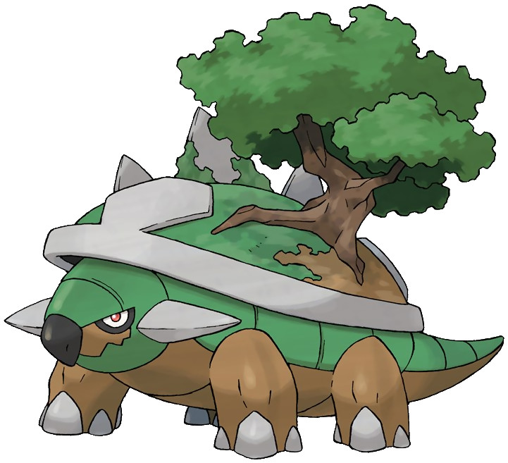

footer: Mickey Chen @ Access Taiwan
slidenumbers: true
build-lists: true
theme: Merriweather, 8

# Diving in to 土台 (Dodai)

---

# Disclaimer!
> I am new!

^
haven't worked with Dodai
worked with dynamic types languages

---

## Dodai -> 土台 -> 地基

---

## What we are going to talk about

- Philosophy
- Development

---

# Philosophy

### My Hypothosis 🤞

---

##[fit] Multi-Tenent Data Layer

---

### Includes...
- Design
- Access Control
- APIs & Client Library

---

## Design

---

### 2 Ways of Accessing Data

1. Through a Server (ie. Antikythera)

2. Directly from User Device

---

[.build-lists:false]

### 2 Ways of Accessing Data

1. Through a Server (ie. Antikythera)

2. ~~Directly from User Device~~

---

[^source]

[^source]: [Getting started in developing app using Dodai: System overview](https://github.com/access-company/Dodai-doc/blob/master/getting_started.md#network-diagram-and-use-cases)

---

[^source]

[^source]: [Data flow during HTTP request processing in Dodai API server](https://github.com/access-company/Dodai/blob/master/internal-doc/design/data_flow.md)

^
Play Framework -> no ORM
Repo -> Actions on Collections
Model -> Describes the Entities, encode & decode

---

[.build-lists:false]

### Data Modeling, pt. 1

- Administrator DB
  - Group Collection
  - App Collection & App Meta Collection

---

[.build-lists:false]

### Data Modeling, pt. 2

- per-group DB (groupId)
  - User Collection
  - Section Collection
  - File Storage Volumes Collection
  - shared Collections
  - app limited Collections
  - Schedule Log Collection

---

[.build-lists:false]

### Data Modeling, pt. 3

- per-app DB (appId)
  - Schedule Log Collection

^
per-app DB is only used in one worker
ScheduledHttpNotificationWorker

---

^ [Getting Started: Sharing of users/devices and data](https://github.com/access-company/Dodai-doc/blob/master/getting_started.md#sharing-of-usersdevices-and-data)

---

[.build-lists:false]

## Access Control

- Section-based Authorization (Path-based Authorization)

^
Kinda like REST

---

---

> _Paste Code Here_

^
couldn't add new section locally
ask for input from more experience team member for input

---

## APIs & Client Libraries

---

### APIs

- 2 Categories
  - Admin (`/admin`)
  - Application (`/v1`)
- `:appId` + `:groupId`
- `/webhook`

^ per App credentials

---

[.build-lists:false]

### Client Libraries

- DodaiClientElixir
- antikythera_acs
- dodai_console
- sazabi

---

[.build-lists:false]

#### working on client libs...

- Script Generated
- `apidata.json`
- Please refer to *[Update the Api document](https://github.com/access-company/Dodai/blob/master/internal-doc/development/update_api_document.md)*

---

# Development

---

^
suprise! - Stripe

---

## First you will need Mongo

- 3.0.X
- Docker is probably the easiest

^ brew only has 3.2.X

---

[.build-lists:false]

## Then you will need Scala env

- Java Runtime ([AWS Corretto 8](https://docs.aws.amazon.com/corretto/latest/corretto-8-ug/macos-install.html))
- 2.13.0
- install sbt (1.2.8)
- `sbt build`
- [Play! framework](https://www.playframework.com/)

^
I just use the latest asdf java runtime
Play - java & scala webframework in Akka

---

### ... if you don't speak Scala

> ##*[Scala School](https://twitter.github.io/scala_school/index.html)* 愛你

^
by twitter
few chapters get you a long way

---

## oh yeah... you probably also need Ruby env

- 2.4.4
- `gem install bundler`
- Scripts
- `cd scripts && bundle`

---

`./scripts/local/setup-mongodb-dodai-console.rb`

---

## Almost done...

- `sbt run`
- `http://localhost:9000/healthcheck`
- `http://localhost:9000/dbhealthcheck`
- Postman

---

# Thank You!
### (Please let me know I missed anything)

---

### Special Thanks

# Cola-son

---

### Sources
[Dodai Doc](https://github.com/access-company/Dodai-doc)
[Dodai Internal Doc](https://github.com/access-company/Dodai/tree/master/internal-doc)

^ Google Translate is your friend

